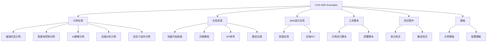

# CHS-SDK Examples 项目架构

## 项目概述

CHS-SDK Examples是CHS-SDK产品的官方示例库，旨在为用户提供完整的学习路径，从基础仿真到高级AI建模，帮助用户掌握CHS-SDK的强大功能。

## 整体架构图

## 目录结构详解

### 核心示例目录 (examples/)

#### 1. 基础仿真示例 (basic-simulation/)
- 目标：演示基础水系统仿真
- 组件：水库、管道、闸门等基础物理组件
- 功能：纯物理仿真，无智能体控制
- 适用场景：学习CHS-SDK基础概念

#### 2. 智能体控制示例 (agent-control/)
- 目标：演示多智能体系统(MAS)
- 组件：感知智能体、控制智能体、中央协调智能体
- 功能：分布式控制、消息驱动架构
- 适用场景：学习智能体系统设计

#### 3. AI建模示例 (ai-modeling/)
- 目标：演示自然语言建模
- 组件：大语言模型集成、自动配置生成
- 功能：自然语言到系统配置的转换
- 适用场景：学习AI辅助建模

#### 4. 高级分析示例 (advanced-analysis/)
- 目标：演示高级分析功能
- 组件：参数识别、模型校准、敏感性分析
- 功能：数据分析和模型优化
- 适用场景：学习高级分析技术

#### 5. 自定义组件示例 (custom-components/)
- 目标：演示自定义组件开发
- 组件：用户自定义物理组件和智能体
- 功能：扩展CHS-SDK功能
- 适用场景：学习组件开发

### 文档资源 (docs/)

#### 快速开始指南 (getting-started.md)
- 安装和配置说明
- 运行示例的步骤
- 常见问题解答

#### 详细教程 (tutorials.md)
- 分步教程
- 高级功能演示
- 最佳实践分享

### Web演示应用 (web-demo/)

#### 前端应用 (frontend/)
- 技术栈：React + TypeScript
- 功能：可视化界面、交互式操作
- 组件：示例选择器、参数配置器、结果展示器

#### 后端API (backend/)
- 技术栈：FastAPI + Python
- 功能：示例管理、仿真执行、结果处理
- 接口：RESTful API设计

### 工具脚本 (scripts/)

#### 示例运行脚本 (run-example.py)
- 统一入口点
- 示例管理功能
- 自动化执行流程

### 测试套件 (tests/)

#### 单元测试
- 示例完整性验证
- 功能模块测试
- 配置文件验证

#### 集成测试
- 端到端测试
- 性能基准测试
- 兼容性测试

### 模板 (templates/)

#### 示例模板 (example-template/)
- 标准目录结构
- 配置文件模板
- 运行脚本模板

## 技术栈

### 核心技术
- Python 3.8+
- CHS-SDK核心库
- YAML配置文件

### Web技术
- 前端：React + TypeScript
- 后端：FastAPI
- 可视化：D3.js, Chart.js

### 开发工具
- 版本控制：Git
- 包管理：pip, npm
- CI/CD：GitHub Actions

## 部署架构

### 本地开发
- 开发服务器热重载
- 本地数据库支持
- 调试工具集成

### 生产部署
- Docker容器化部署
- Kubernetes编排
- 云服务集成

## 扩展性设计

### 插件机制
- 自定义组件插件
- 智能体插件系统
- 可视化插件支持

### API设计
- RESTful接口
- WebSocket实时通信
- GraphQL查询支持

## 安全考虑

### 访问控制
- 用户身份验证
- 权限管理系统
- 数据访问控制

### 数据安全
- 敏感信息加密
- 数据备份策略
- 安全审计日志

## 性能优化

### 缓存策略
- 内存缓存
- 数据库查询缓存
- 前端资源缓存

### 并发处理
- 多线程仿真执行
- 异步任务处理
- 负载均衡支持

## 监控和日志

### 系统监控
- 性能指标监控
- 错误日志收集
- 用户行为分析

### 日志管理
- 结构化日志记录
- 日志级别控制
- 日志轮转策略

## 未来发展规划

### 短期目标
- 增加更多示例类型
- 完善文档和教程
- 优化Web演示应用

### 中期目标
- 支持更多物理组件
- 集成更多AI功能
- 提供在线仿真环境

### 长期目标
- 构建社区生态系统
- 支持多语言界面
- 提供企业级解决方案