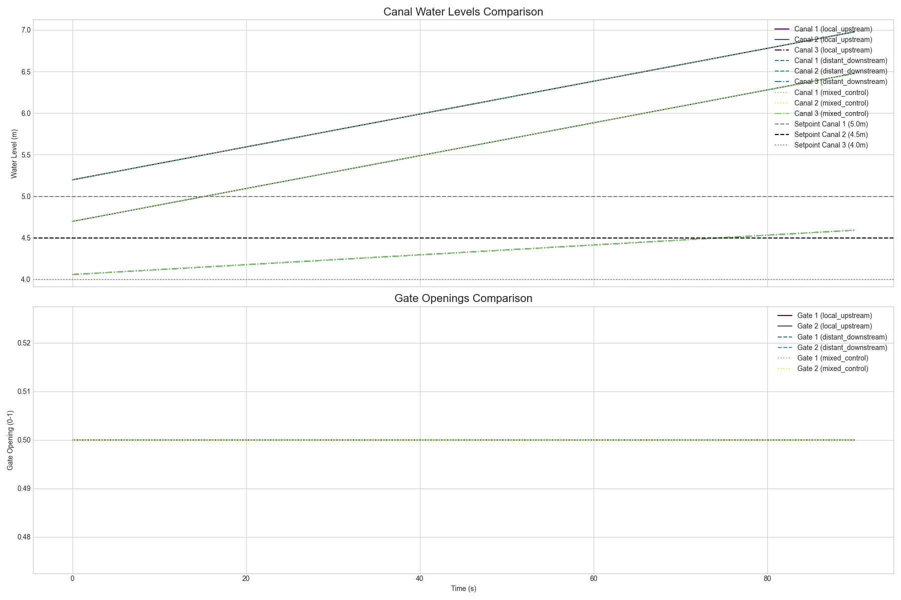

# Example 12: PID Control Strategy Comparison for a Canal System

This example demonstrates and compares three different PID control strategies for regulating water levels in a canal system with two gates and three canal reaches in series.

## System Description

The simulated system consists of:
- An `upstream_reservoir` providing a constant source of water.
- Two `gates` (`gate_1`, `gate_2`) that control the flow.
- Three `canal reaches` (`canal_1`, `canal_2`, `canal_3`) that are modeled using a custom `IntegralDelayCanal` physical model. This model simulates the storage and time delay characteristics of a real canal.

The components are connected in a series:
`Reservoir -> Gate 1 -> Canal 1 -> Canal 2 -> Gate 2 -> Canal 3`

## Control Strategies Compared

The core of this example is to compare how different control architectures handle the coupling and delays in this series system. We evaluate three distinct strategies:

### 1. Local Upstream Control
- **Gate 1** controls the water level in **Canal 1**.
- **Gate 2** controls the water level in **Canal 2**.
This is a fully decentralized strategy. Each controller only uses local information. It is simple to implement but may perform poorly due to ignoring downstream dynamics.

### 2. Distant Downstream Control
- **Gate 1** controls the water level in **Canal 2**.
- **Gate 2** controls the water level in **Canal 3**.
This strategy attempts to control levels further downstream, which can provide more stable system-wide regulation but is more challenging to tune due to the long time delays.

### 3. Mixed Control
- **Gate 1** controls the water level in **Canal 1** (Local).
- **Gate 2** controls the water level in **Canal 3** (Distant).
This is a hybrid approach, combining elements of both local and distant control.

## How to Run the Example

To run the simulation and generate the comparison plot, execute the following command from the root of the repository:

```bash
python docs/examples/agent_based/12_pid_control_comparison/run_pid_comparison.py
```

The script will run all three scenarios sequentially and save the results to `results_local_upstream.csv`, `results_distant_downstream.csv`, and `results_mixed_control.csv`. It will also generate a comparison plot named `pid_comparison_results.png`.

## Expected Results

The generated plot will show the water levels in the three canals and the openings of the two gates for each of the three control strategies. This allows for a visual comparison of their performance in terms of stability, response time, and ability to maintain the desired setpoints.


