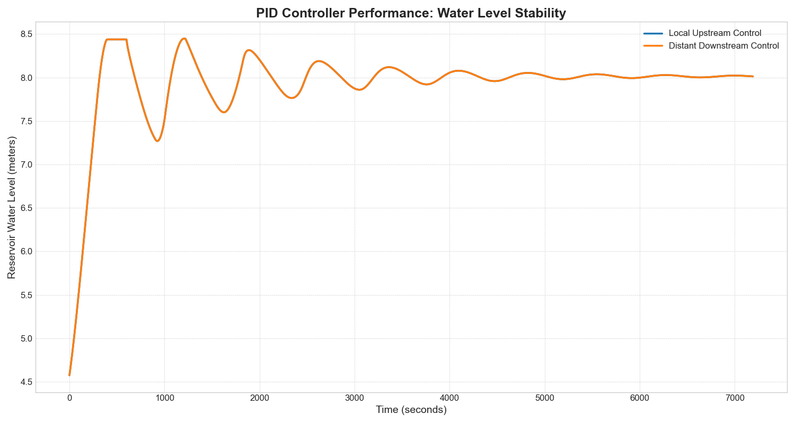

# 渠道系统PID控制策略对比（用户定义逻辑）

本示例根据特定的用户定义逻辑，演示并比较了两种不同的PID控制策略。

## 系统描述

模拟的系统已经根据用户要求进行了简化和修改，包含以下部分：
- 一个`upstream_reservoir`（上游水库），提供稳定的水源。
- 两个`gates`（闸门）（`gate_1`, `gate_2`）。
- 两个`canal reaches`（渠段）（`canal_1`, `canal_2`），使用`IntegralDelayCanal`（积分时滞渠道）模型进行建模。

这些组件的连接方式如下，两个闸门之间只有一个渠段：
`水库 -> 闸门1 -> 渠道1 -> 闸门2 -> 渠道2`

## 控制策略比较

本示例的核心是比较两种根据用户具体要求定义的控制策略：

### 1. 本地上游控制 (Local Upstream Control) - 用户定义
- **控制目标**: 控制闸门**上游**的水位。
- **实现**:
  - **闸门2** 的PID控制器监测并调节其上游 **渠道1** 的水位，目标水位为5.0米。
  - **闸门1** 在此场景中不进行动态控制，保持一个固定的初始开度，以模拟稳定的上游来水条件。

### 2. 远程下游控制 (Distant Downstream Control) - 用户定义
- **控制目标**: 控制闸门**下游**的水位。
- **实现**:
  - **闸门1** 的PID控制器监测并调节其下游 **渠道1** 的水位，目标水位为5.0米。
  - **闸门2** 的PID控制器监测并调节其下游 **渠道2** 的水位，目标水位为4.5米。

## 如何运行示例

要运行模拟并生成比较图，请从代码库的根目录执行以下命令：

```bash
python examples/canal_model/canal_pid_control/run_pid_comparison.py
```

该脚本将依次运行所有两个场景，并将结果保存到`results_local_upstream_user_def.csv`和`results_distant_downstream_user_def.csv`。它还将生成一个名为`pid_comparison_results.png`的比较图。

## 预期结果

生成的图表将显示两种控制策略下两个渠道的水位和两个闸门的开度。这使得可以直观地比较它们在稳定性、响应时间和维持期望设定值方面的性能。


