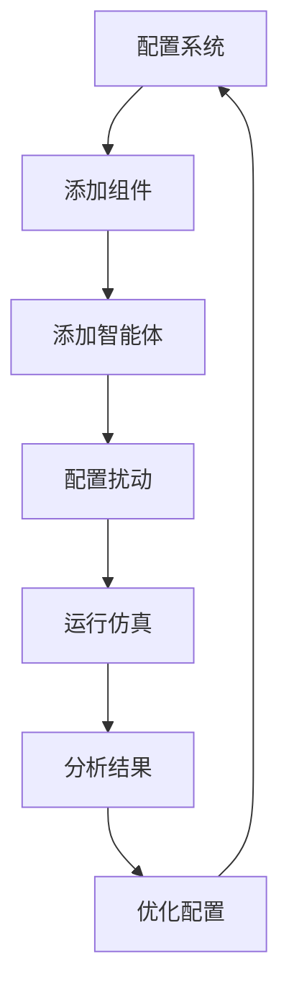

# 用户使用指南

## 目录

1. [快速入门](#快速入门)
2. [基础概念](#基础概念)
3. [配置管理](#配置管理)
4. [扰动测试](#扰动测试)
5. [性能监控](#性能监控)
6. [高级功能](#高级功能)
7. [最佳实践](#最佳实践)

## 快速入门

### 第一次运行

1. **环境准备**
   ```bash
   # 确保Python 3.8+已安装
   python --version
   
   # 安装依赖
   pip install -r requirements.txt
   ```

2. **验证安装**
   ```bash
   # 验证配置文件
   python yaml_scenario_validator.py
   
   # 运行基础测试
   python enhanced_single_disturbance_test.py
   ```

3. **查看结果**
   - 测试结果保存在相应的输出目录中
   - 查看生成的JSON报告文件

### 基础工作流程



## 基础概念

### 系统架构

分布式数字孪生仿真系统采用分层架构：

1. **物理层**: 水利工程物理组件（水库、闸门、渠道等）
2. **控制层**: 智能体和控制算法
3. **通信层**: 消息总线和网络通信
4. **仿真层**: 仿真引擎和时间管理
5. **扰动层**: 各种扰动和故障模拟

### 核心组件

#### 1. 仿真框架 (Simulation Harness)
- 管理整个仿真生命周期
- 协调各个组件的交互
- 提供统一的接口

#### 2. 物理组件 (Physical Components)
- **水库 (Reservoir)**: 蓄水和调节功能
- **闸门 (Gate)**: 流量控制设备
- **渠道 (Channel)**: 水流传输通道
- **分水口 (Diversion)**: 水流分配节点

#### 3. 智能体 (Agents)
- 实现控制逻辑
- 响应系统状态变化
- 执行决策算法

#### 4. 扰动系统 (Disturbance System)
- 模拟各种故障和异常情况
- 测试系统鲁棒性
- 评估应急响应能力

## 配置管理

### 配置文件结构

系统使用YAML格式的配置文件：

```
config.yml          # 主配置文件
agents.yml          # 智能体配置
components.yml      # 组件配置
topology.yml        # 拓扑结构配置
disturbance_scenarios/  # 扰动场景配置目录
```

### 主配置文件详解

```yaml
# config.yml
simulation:
  name: "我的仿真项目"           # 项目名称
  description: "项目描述"        # 项目描述
  version: "1.0.0"              # 版本号

time_config:
  start_time: 0                 # 仿真开始时间
  end_time: 100                 # 仿真结束时间
  dt: 1.0                       # 时间步长

solver_config:
  type: "euler"                 # 求解器类型
  tolerance: 1e-6               # 收敛容差
  max_iterations: 1000          # 最大迭代次数

parallel_config:
  enable_parallel: true         # 启用并行计算
  num_processes: 4              # 进程数量
  load_balancing: "dynamic"     # 负载均衡策略

system_architecture:
  layers:
    - name: "physical_layer"    # 物理层
      components: ["reservoirs", "gates", "channels"]
    - name: "control_layer"     # 控制层
      components: ["agents", "controllers"]
    - name: "communication_layer" # 通信层
      components: ["message_bus", "network"]
```

### 组件配置详解

```yaml
# components.yml
components:
  - id: "main_reservoir"        # 组件唯一标识
    class: "Reservoir"           # 组件类型
    initial_state:               # 初始状态
      water_level: 100.0
      volume: 5000.0
      inflow: 0.0
      outflow: 0.0
    parameters:                  # 参数配置
      surface_area: 50.0
      capacity: 10000.0
      min_level: 0.0
      max_level: 200.0
    
  - id: "control_gate"          # 闸门配置
    class: "Gate"
    initial_state:
      opening: 0.5
      flow_rate: 25.0
    parameters:
      max_flow_rate: 100.0
      response_time: 2.0
```

### 智能体配置详解

```yaml
# agents.yml
agents:
  - id: "water_level_controller" # 智能体标识
    class: "PIDController"        # 智能体类型
    config:                       # 配置参数
      target_component: "main_reservoir"
      control_variable: "water_level"
      setpoint: 150.0
      kp: 1.0                     # 比例增益
      ki: 0.1                     # 积分增益
      kd: 0.05                    # 微分增益
    
  - id: "flow_optimizer"        # 流量优化智能体
    class: "OptimizationAgent"
    config:
      objective: "minimize_energy"
      constraints:
        - "water_level >= 100"
        - "flow_rate <= 80"
```

## 扰动测试

### 扰动类型详解

#### 1. 入流扰动 (Inflow Disturbance)

模拟上游来水变化，包括洪水、干旱等情况。

```yaml
# inflow_disturbance.yml
disturbance:
  id: "flood_scenario"          # 扰动标识
  type: "inflow_change"         # 扰动类型
  description: "洪水场景"       # 描述
  target_component: "main_reservoir" # 目标组件
  start_time: 10.0              # 开始时间
  end_time: 50.0                # 结束时间
  parameters:
    target_inflow: 200.0        # 目标入流量
    change_rate: 10.0           # 变化速率
    pattern: "step"             # 变化模式: step, ramp, sine
```

**使用示例**:
```python
from core_lib.disturbances.disturbance_framework import (
    InflowDisturbance, DisturbanceConfig, DisturbanceType
)

# 创建入流扰动配置
config = DisturbanceConfig(
    disturbance_id="flood_test",
    disturbance_type=DisturbanceType.INFLOW_CHANGE,
    target_component_id="main_reservoir",
    start_time=10.0,
    end_time=30.0,
    intensity=1.0,
    parameters={
        "target_inflow": 150.0,
        "change_rate": 5.0
    }
)

# 创建扰动实例
disturbance = InflowDisturbance(config)

# 添加到仿真中
harness.add_disturbance(disturbance)
```

#### 2. 传感器噪声 (Sensor Noise)

模拟传感器测量误差和设备老化。

```yaml
# sensor_noise.yml
disturbance:
  id: "sensor_degradation"      # 扰动标识
  type: "sensor_noise"          # 扰动类型
  description: "传感器老化"     # 描述
  target_component: "main_reservoir" # 目标组件
  start_time: 20.0              # 开始时间
  end_time: 80.0                # 结束时间
  parameters:
    noise_level: 0.1            # 噪声强度
    affected_sensors:           # 受影响的传感器
      - "water_level"
      - "flow_rate"
    noise_type: "gaussian"      # 噪声类型
    correlation: 0.0            # 噪声相关性
```

#### 3. 执行器故障 (Actuator Failure)

模拟设备故障和维护情况。

```yaml
# actuator_failure.yml
disturbance:
  id: "gate_malfunction"        # 扰动标识
  type: "actuator_failure"      # 扰动类型
  description: "闸门故障"       # 描述
  target_component: "control_gate" # 目标组件
  start_time: 30.0              # 开始时间
  end_time: 60.0                # 结束时间
  parameters:
    failure_type: "partial"     # 故障类型: complete, partial, intermittent
    efficiency_factor: 0.6      # 效率因子
    target_actuator: "gate_motor" # 目标执行器
    recovery_time: 5.0          # 恢复时间
```

#### 4. 网络扰动 (Network Disturbance)

模拟通信延迟和数据丢失。

```yaml
# network_disturbance.yml
disturbance:
  id: "communication_issue"     # 扰动标识
  type: "network_disturbance"   # 扰动类型
  description: "通信故障"       # 描述
  start_time: 40.0              # 开始时间
  end_time: 70.0                # 结束时间
  parameters:
    delay_ms: 100               # 延迟毫秒数
    packet_loss_rate: 0.05      # 丢包率
    jitter_ms: 20               # 抖动
    affected_connections:       # 受影响的连接
      - "agent_to_component"
      - "component_to_sensor"
```

### 组合扰动测试

可以同时应用多种扰动来测试复杂场景：

```python
# 创建组合扰动场景
scenario_disturbances = [
    # 首先是入流增加
    InflowDisturbance(DisturbanceConfig(
        disturbance_id="combined_inflow",
        disturbance_type=DisturbanceType.INFLOW_CHANGE,
        target_component_id="main_reservoir",
        start_time=10.0,
        end_time=40.0,
        intensity=1.0,
        parameters={"target_inflow": 180.0}
    )),
    
    # 然后是传感器噪声
    SensorNoiseDisturbance(DisturbanceConfig(
        disturbance_id="combined_sensor",
        disturbance_type=DisturbanceType.SENSOR_NOISE,
        target_component_id="main_reservoir",
        start_time=20.0,
        end_time=60.0,
        intensity=0.5,
        parameters={
            "noise_level": 0.15,
            "affected_sensors": ["water_level"],
            "noise_type": "gaussian"
        }
    )),
    
    # 最后是执行器故障
    ActuatorFailureDisturbance(DisturbanceConfig(
        disturbance_id="combined_actuator",
        disturbance_type=DisturbanceType.ACTUATOR_FAILURE,
        target_component_id="control_gate",
        start_time=30.0,
        end_time=50.0,
        intensity=0.8,
        parameters={
            "failure_type": "partial",
            "efficiency_factor": 0.5
        }
    ))
]

# 添加所有扰动
for disturbance in scenario_disturbances:
    harness.add_disturbance(disturbance)
```

### 扰动测试最佳实践

1. **渐进式测试**
   - 先测试单一扰动
   - 再测试组合扰动
   - 最后测试复杂场景

2. **参数调优**
   - 从小强度开始
   - 逐步增加扰动强度
   - 记录系统响应

3. **结果分析**
   - 监控关键指标
   - 分析系统稳定性
   - 评估恢复能力

## 性能监控

### 系统性能指标

系统提供多种性能监控功能：

1. **仿真性能**
   - 仿真速度 (步/秒)
   - 时间步长稳定性
   - 收敛性能

2. **系统资源**
   - CPU使用率
   - 内存使用量
   - 网络带宽

3. **组件性能**
   - 组件响应时间
   - 状态更新频率
   - 计算精度

### 性能监控工具

#### 1. 集成性能验证器

```bash
# 运行完整的性能验证
python integration_performance_validator.py
```

这将执行：
- 基础集成测试
- 压力测试
- 并发测试
- 内存泄漏测试
- 稳定性测试

#### 2. 实时监控

```python
from integration_performance_validator import SystemMonitor

# 创建监控器
monitor = SystemMonitor()

# 开始监控
monitor.start_monitoring(interval=1.0)

# 运行仿真
harness.run_simulation()

# 停止监控
monitor.stop_monitoring()

# 获取性能摘要
summary = monitor.get_summary()
print(f"平均CPU使用率: {summary['cpu_usage']['avg']:.2f}%")
print(f"平均内存使用率: {summary['memory_usage']['avg_percent']:.2f}%")
```

### 性能优化建议

1. **时间步长优化**
   - 根据系统动态特性选择合适的时间步长
   - 平衡精度和性能

2. **并行计算**
   - 启用并行计算功能
   - 合理设置进程数量

3. **内存管理**
   - 定期清理历史数据
   - 使用内存映射文件

4. **网络优化**
   - 减少不必要的消息传递
   - 使用消息批处理

## 高级功能

### 自定义组件

可以创建自定义的物理组件：

```python
from core_lib.physical_objects.base_component import BaseComponent

class CustomPump(BaseComponent):
    """自定义水泵组件"""
    
    def __init__(self, name, initial_state, parameters):
        super().__init__(name, initial_state, parameters)
        self.pump_efficiency = parameters.get('efficiency', 0.85)
        self.max_power = parameters.get('max_power', 1000.0)
    
    def step(self, dt, current_time):
        """组件仿真步骤"""
        # 实现水泵的物理模型
        power_consumption = self.calculate_power_consumption()
        flow_rate = self.calculate_flow_rate()
        
        # 更新状态
        self.state['power'] = power_consumption
        self.state['flow_rate'] = flow_rate
        
        return self.state
    
    def calculate_power_consumption(self):
        """计算功率消耗"""
        # 实现功率计算逻辑
        pass
    
    def calculate_flow_rate(self):
        """计算流量"""
        # 实现流量计算逻辑
        pass
```

### 自定义智能体

创建智能控制算法：

```python
from core_lib.agents.base_agent import BaseAgent

class AdaptiveController(BaseAgent):
    """自适应控制器"""
    
    def __init__(self, name, config):
        super().__init__(name)
        self.target_component = config['target_component']
        self.setpoint = config['setpoint']
        self.adaptation_rate = config.get('adaptation_rate', 0.01)
    
    def step(self, current_time):
        """控制步骤"""
        # 获取当前状态
        current_state = self.get_component_state(self.target_component)
        
        # 计算控制误差
        error = self.setpoint - current_state['water_level']
        
        # 自适应控制算法
        control_action = self.adaptive_control(error, current_time)
        
        # 发送控制指令
        self.send_control_command(self.target_component, control_action)
    
    def adaptive_control(self, error, time):
        """自适应控制算法"""
        # 实现自适应控制逻辑
        pass
```

### 自定义扰动

创建特定的扰动类型：

```python
from core_lib.disturbances.base_disturbance import BaseDisturbance

class SeasonalVariation(BaseDisturbance):
    """季节性变化扰动"""
    
    def __init__(self, config):
        super().__init__(config)
        self.amplitude = config.parameters.get('amplitude', 50.0)
        self.period = config.parameters.get('period', 365.0)  # 天
    
    def apply_disturbance(self, component, current_time):
        """应用季节性扰动"""
        if self.is_active(current_time):
            # 计算季节性变化
            seasonal_factor = self.amplitude * math.sin(
                2 * math.pi * current_time / self.period
            )
            
            # 修改组件状态
            if hasattr(component, 'state') and 'inflow' in component.state:
                base_inflow = component.parameters.get('base_inflow', 100.0)
                component.state['inflow'] = base_inflow + seasonal_factor
            
            return True
        return False
```

## 最佳实践

### 项目组织

1. **目录结构**
   ```
   my_simulation_project/
   ├── config/              # 配置文件
   │   ├── config.yml
   │   ├── agents.yml
   │   └── components.yml
   ├── scenarios/           # 场景定义
   │   ├── normal_operation.py
   │   ├── emergency_response.py
   │   └── maintenance_mode.py
   ├── custom_components/   # 自定义组件
   │   ├── __init__.py
   │   ├── pumps.py
   │   └── sensors.py
   ├── analysis/           # 分析脚本
   │   ├── performance_analysis.py
   │   └── result_visualization.py
   └── results/            # 结果输出
       ├── simulation_data/
       └── reports/
   ```

2. **版本控制**
   - 使用Git管理代码版本
   - 配置文件单独版本控制
   - 结果文件不纳入版本控制

3. **文档管理**
   - 及时更新配置文档
   - 记录重要的设计决策
   - 维护变更日志

### 测试策略

1. **单元测试**
   ```python
   import unittest
   from my_components import CustomPump
   
   class TestCustomPump(unittest.TestCase):
       def setUp(self):
           self.pump = CustomPump(
               name="test_pump",
               initial_state={'power': 0, 'flow_rate': 0},
               parameters={'efficiency': 0.9, 'max_power': 500}
           )
       
       def test_power_calculation(self):
           # 测试功率计算
           pass
       
       def test_flow_rate_calculation(self):
           # 测试流量计算
           pass
   ```

2. **集成测试**
   ```python
   def test_pump_reservoir_integration():
       # 测试水泵和水库的集成
       harness = EnhancedSimulationHarness(config)
       harness.add_component("pump", pump)
       harness.add_component("reservoir", reservoir)
       harness.build()
       harness.run_simulation()
       
       # 验证结果
       assert len(harness.history) > 0
   ```

3. **性能测试**
   ```python
   def test_large_scale_performance():
       # 测试大规模仿真性能
       start_time = time.time()
       
       # 运行大规模仿真
       harness = create_large_scale_simulation()
       harness.run_simulation()
       
       execution_time = time.time() - start_time
       assert execution_time < 60  # 应在60秒内完成
   ```

### 调试技巧

1. **日志配置**
   ```python
   import logging
   
   # 配置详细日志
   logging.basicConfig(
       level=logging.DEBUG,
       format='%(asctime)s - %(name)s - %(levelname)s - %(message)s',
       handlers=[
           logging.FileHandler('simulation.log'),
           logging.StreamHandler()
       ]
   )
   ```

2. **状态检查**
   ```python
   # 在关键点检查组件状态
   def debug_component_state(component, time):
       logger.debug(f"Time {time}: {component.name} state = {component.state}")
   
   # 在仿真循环中调用
   for t in simulation_times:
       debug_component_state(reservoir, t)
       harness.step()
   ```

3. **可视化调试**
   ```python
   import matplotlib.pyplot as plt
   
   def plot_simulation_results(history):
       times = [h['time'] for h in history]
       water_levels = [h['components']['reservoir']['water_level'] for h in history]
       
       plt.figure(figsize=(10, 6))
       plt.plot(times, water_levels)
       plt.xlabel('Time (s)')
       plt.ylabel('Water Level (m)')
       plt.title('Water Level Over Time')
       plt.grid(True)
       plt.show()
   ```

### 性能优化

1. **配置优化**
   ```yaml
   # 针对性能优化的配置
   parallel_config:
     enable_parallel: true
     num_processes: 8          # 根据CPU核心数调整
     load_balancing: "dynamic"
     chunk_size: 100           # 批处理大小
   
   solver_config:
     type: "rk4"               # 使用高精度求解器
     adaptive_step: true       # 自适应步长
     tolerance: 1e-6
   ```

2. **内存优化**
   ```python
   # 定期清理历史数据
   def cleanup_history(harness, keep_last_n=1000):
       if len(harness.history) > keep_last_n:
           harness.history = harness.history[-keep_last_n:]
   
   # 使用生成器减少内存占用
   def process_simulation_data(history):
       for record in history:
           yield process_record(record)
   ```

3. **计算优化**
   ```python
   # 使用NumPy加速计算
   import numpy as np
   
   def vectorized_calculation(data_array):
       # 使用向量化操作替代循环
       return np.sum(data_array * coefficients)
   ```

---

通过遵循本指南，您可以有效地使用分布式数字孪生仿真系统进行水利工程的仿真和分析。如有问题，请参考API文档或联系技术支持。
